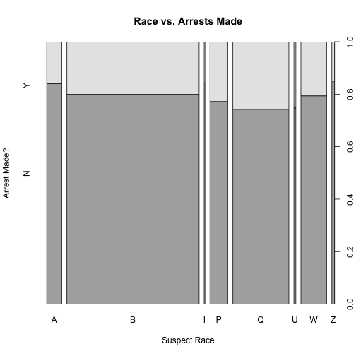

## Introduction to R Tutorial

Before we move on to all of the fun machine learning material, we first need to get acquianted with some of the things that R can do and some of the basic knowledge that you'll need to work with data in R.

For this introduction we will learn how to:

* Import and export data in R.
* Packages in R. 
* Basic data summarization and visualizations.
* Control structures
  + Creating functions.
  + For, if, while and all that.
* Basic statistical inference:
  + Linear regression.
  + Logistic regression.
  
  
This will all be done using some very messy [Stop, Question and Frisk Data from the NYPD](https://www1.nyc.gov/site/nypd/stats/reports-analysis/stopfrisk.page) which contains information about over 100,000 police citizen interactions between 2003-2016 so let's get started!

## Importing and exporting data in R

* Importing data from a local directory.
* Importing data from Github and other websites.

The first thing that we will want to do is to be able to use R to import and export data. There are many different ways to do this and in this tutorial, I will show you how to load data into R from your **local directory** and how to **load data from Github** and websites more generally.

### Packages

One of the things that makes R such a powerful statistical tool are the freely available and high quality packages which are constantly being written by users almost daily. For our purposes we will be loading two packages: 

* **foreign** package which allows for the important of .csv, .dta and other file types and;
* **RCurl** which provides a set of tools that allow you to connect R to the internet. 


```r
library(foreign)
library(RCurl)
```
If get the following error message when you try to load the library, then you have to first install the package:


```r
Error in library(RCurl) : there is no package called ‘RCurl’
```

```
## Error: <text>:1:7: unexpected 'in'
## 1: Error in
##           ^
```

So try:


```r
install.packages("foreign")
```

```
## Error in install.packages : Updating loaded packages
```

```r
install.packages("RCurl")
```

```
## Error in install.packages : Updating loaded packages
```

and then run: 


```r
library(foreign)
library(RCurl)
```

### Importing data from a local directory

This is relatively easy to do. First, find out where your data is located, go into your working directory and then just load the data from your working directory.


```r
rm(list = ls()) # This cleans up the workspace

localdir = "/Users/jason/Dropbox/Princeton-Classes-Spring-2018/Applied Machine Learning/WWS586A-Machine-Learning-Policy-Analysis/Data"

setwd(localdir) #This will set your working directory to the right place

list.files(localdir) # What are the files in the local directory?
```

```
## [1] "~$2016 SQF File Spec.xlsx" "2016 SQF File Spec.xlsx"  
## [3] "racevarrest.png"           "stop-and-frisk2016.csv"
```


Looks good! Now let's load the data


```r
stopandfrisk2016<-read.csv("stop-and-frisk2016.csv") # Use the "read.csv" function to load the data
```

```
## Warning in file(file, "rt"): cannot open file 'stop-and-frisk2016.csv': No
## such file or directory
```

```
## Error in file(file, "rt"): cannot open the connection
```

```r
ls() # check to see if the data is loaded
```

```
## [1] "localdir"
```


### Importing data from the web/Github


```r
stopandfrisk2016<-read.csv(text=getURL("https://raw.githubusercontent.com/ljanastas/WWS586A-Machine-Learning-Policy-Analysis/master/Data/stop-and-frisk2016.csv"),  header=T)
```


## Basic Data Summarization and Visualization

Now that we have all of the data that we want loaded, let's first get a sense of the dimensionality of the data:


```r
dim(stopandfrisk2016)
```

```
## [1] 12405   112
```

This tells us that we have 12,405 observations (stops) and have 112 variables which were collected for the stops. 

If we're interested in taking a look at data we can use:


```r
head(stopandfrisk2016)
```

```
##   year pct ser_num datestop timestop recstat inout trhsloc perobs
## 1 2016  41      22  2072016      100       A     O       P      1
## 2 2016  10      22  2182016       30       1     O       P      8
## 3 2016  66       1  1012016       30       1     I       P      2
## 4 2016  47      18  1012016       40       1     O       H      1
## 5 2016  79       1  1012016       50       1     O       P      3
## 6 2016  73       1  1012016      100       1     O       P      1
##      crimsusp perstop typeofid explnstp othpers arstmade arstoffn sumissue
## 1        BURG       8        P        Y       N        N                 Y
## 2 MISDEMEANOR      10        P        Y       Y        N                 N
## 3         FEL      10        P        Y       N        Y  ASSAULT        N
## 4         FEL       2        V        Y       N        N                 N
## 5      D.W.I.      10        P        Y       N        N                 N
## 6      FELONY       5        R        Y       N        N                 N
##   sumoffen compyear comppct offunif officrid frisked searched contrabn
## 1  TRESPAS        0       0       N                Y        Y        N
## 2                 0       0       N                N        Y        N
## 3                 0       0       Y                Y        Y        N
## 4                 0       0       Y                Y        N        N
## 5                 0       0       Y                N        N        N
## 6                 0       0       Y                Y        N        N
##   adtlrept pistol riflshot asltweap knifcuti machgun othrweap pf_hands
## 1        N      N        N        N        N       N        N        N
## 2        N      N        N        N        N       N        N        Y
## 3        N      N        N        N        N       N        N        N
## 4        N      N        N        N        N       N        N        Y
## 5        N      N        N        N        N       N        N        N
## 6        N      N        N        N        N       N        N        N
##   pf_wall pf_grnd pf_drwep pf_ptwep pf_baton pf_hcuff pf_pepsp pf_other
## 1       N       N        N        N        N        Y        N        N
## 2       Y       N        N        N        N        N        N        N
## 3       N       N        N        N        N        N        N        N
## 4       N       N        N        Y        N        Y        N        N
## 5       N       N        N        N        N        N        N        N
## 6       N       N        N        N        N        N        N        N
##   radio ac_rept ac_inves rf_vcrim rf_othsw ac_proxm rf_attir cs_objcs
## 1     N       N        N        N        N        N        N        N
## 2     Y       N        N        N        N        N        N        N
## 3     Y       Y        N        N        Y        N        N        N
## 4     N       N        N        Y        N        Y        N        N
## 5     N       N        N        N        N        N        N        N
## 6     N       N        Y        N        Y        N        N        N
##   cs_descr cs_casng cs_lkout rf_vcact cs_cloth cs_drgtr ac_evasv ac_assoc
## 1        N        Y        N        N        N        N        N        Y
## 2        N        N        N        N        N        Y        Y        N
## 3        Y        N        N        N        N        N        N        N
## 4        Y        N        N        N        N        N        N        N
## 5        N        N        N        N        N        N        N        N
## 6        N        N        N        N        N        N        Y        N
##   cs_furtv rf_rfcmp ac_cgdir rf_verbl cs_vcrim cs_bulge cs_other ac_incid
## 1        Y        N        Y        N        N        N        N        Y
## 2        Y        N        N        N        N        N        Y        Y
## 3        N        N        N        N        N        N        N        N
## 4        Y        Y        Y        N        N        N        N        N
## 5        N        N        N        N        N        N        Y        N
## 6        N        N        N        N        N        N        Y        Y
##   ac_time rf_knowl ac_stsnd ac_other sb_hdobj sb_outln sb_admis sb_other
## 1       Y        N        N        N        N        N        N        Y
## 2       Y        N        N        N        N        N        N        Y
## 3       N        N        N        N        N        N        N        Y
## 4       N        N        N        N        N        N        N        N
## 5       N        N        N        Y        N        N        N        N
## 6       N        N        N        N        N        N        N        N
##   repcmd revcmd rf_furt rf_bulg offverb offshld forceuse sex race dob age
## 1     41     40       Y       N       V       S       SF   M    B  NA  48
## 2     10     10       N       N               S            M    W  NA  20
## 3     66     66       N       N                            M    P  NA  34
## 4    808    808       Y       N                       SW   M    B  NA  33
## 5     79     79       N       N                            M    B  NA  22
## 6    425    425       N       N                            M    B  NA  30
##   ht_feet ht_inch weight haircolr eyecolor build othfeatr addrtyp rescode
## 1       6       2    180       BK       BR     T               NA      NA
## 2       5       8    150       BR       BR     T               NA      NA
## 3       5       6    140       BK       BR     M               NA      NA
## 4       5       9    180       BK       BR     M               NA      NA
## 5       5      11    160       BK       BL     T               NA      NA
## 6       5      10    160       BK       BR     M               NA      NA
##   premtype             premname addrnum           stname         stinter
## 1       NA               STREET                             BARRY STREET
## 2       NA CAR ON PUBLIC STREET                           WEST 26 STREET
## 3       NA                         1382        40 STREET       14 AVENUE
## 4       NA                         1890 SCHIEFELIN PLACE EAST 229 STREET
## 5       NA           COMMERICAL                             MACON STREET
## 6       NA               STREET                            FULTON STREET
##            crossst aptnum      city state zip addrpct sector beat post
## 1 OAK POINT AVENUE     NA     BRONX    NA  NA      41      B    2   NA
## 2        10 AVENUE     NA MANHATTAN    NA  NA      10      D        NA
## 3        13 AVENUE     NA  BROOKLYN    NA  NA      66      F        NA
## 4  EAST 225 STREET     NA     BRONX    NA  NA      47      C        NA
## 5  NOSTRAND AVENUE     NA  BROOKLYN    NA  NA      79      G    4   NA
## 6   BOYLAND STREET     NA  BROOKLYN    NA  NA      73      B    2   NA
##    xcoord ycoord dettypCM lineCM detailCM
## 1 1013353 234000       CM      1       14
## 2  983478 212373       CM      1       28
## 3  988340 172111       CM      1        9
## 4      NA     NA       CM      1       20
## 5  998197 187413       CM      1      112
## 6 1008226 186458       CM      1       20
```


Imagine that we are interested in determining some of the individual level correlates of being arrested and we are most concerned that race is being used by officers as a factor for arresting suspects. Let's explore the connection between the following varibles:

* **arstmade** - Was an arrest made?
* **race** - Race of the suspect.
* **timestop** - Time that the suspect was stopped. 
* **datestop** - Date that the suspect was stopped. 
* **age** - Suspect's age.


```r
attach(stopandfrisk2016) #Allows us to more easily access the variables.
```

```
## The following objects are masked from stopandfrisk2016 (pos = 4):
## 
##     ac_assoc, ac_cgdir, ac_evasv, ac_incid, ac_inves, ac_other,
##     ac_proxm, ac_rept, ac_stsnd, ac_time, addrnum, addrpct,
##     addrtyp, adtlrept, age, aptnum, arstmade, arstoffn, asltweap,
##     beat, build, city, comppct, compyear, contrabn, crimsusp,
##     crossst, cs_bulge, cs_casng, cs_cloth, cs_descr, cs_drgtr,
##     cs_furtv, cs_lkout, cs_objcs, cs_other, cs_vcrim, datestop,
##     detailCM, dettypCM, dob, explnstp, eyecolor, forceuse,
##     frisked, haircolr, ht_feet, ht_inch, inout, knifcuti, lineCM,
##     machgun, officrid, offshld, offunif, offverb, othfeatr,
##     othpers, othrweap, pct, perobs, perstop, pf_baton, pf_drwep,
##     pf_grnd, pf_hands, pf_hcuff, pf_other, pf_pepsp, pf_ptwep,
##     pf_wall, pistol, post, premname, premtype, race, radio,
##     recstat, repcmd, rescode, revcmd, rf_attir, rf_bulg, rf_furt,
##     rf_knowl, rf_othsw, rf_rfcmp, rf_vcact, rf_vcrim, rf_verbl,
##     riflshot, sb_admis, sb_hdobj, sb_other, sb_outln, searched,
##     sector, ser_num, sex, state, stinter, stname, sumissue,
##     sumoffen, timestop, trhsloc, typeofid, weight, xcoord, ycoord,
##     year, zip
```

```r
# Let's check out what these variables look like
summary(arstmade)
```

```
##         N    Y 
##    1 9761 2643
```

```r
summary(race)
```

```
##         A    B    I    P    Q    U    W    Z 
##    1  737 6498   38  873 2753   95 1270  140
```

```r
summary(age)
```

```
##      **   1  10  11  12  13  14  15  16  17  18  19   2  20  21  22  23 
##   1  34  37   5   6  33  80 175 391 557 563 645 667   1 703 567 544 542 
##  24  25  26  27  28  29   3  30  31  32  33  34  35  36  37  38  39  40 
## 471 516 420 346 343 312   1 338 262 234 257 220 249 244 182 187 183 171 
##  41  42  43  44  45  46  47  48  49   5  50  51  52  53  54  55  56  57 
## 135 127 129 109 121 119  94  96  92   3 123  73  84  70  77  83  60  55 
##  58  59  60  61  62  63  64  65  66  67  68  69  70  71  72  73  74  75 
##  45  40  28  27  23  18  23  11  10   4   4   2   4   2   2   2   1   5 
##  76  77  78   8  80  82  83   9  92  96  99 
##   3   2   1   1   1   1   1   1   1   1   4
```


Let's create a plot of arrests made vs. race


```r
plot(race,arstmade, main = "Race vs. Arrests Made", ylab="Arrest Made?", xlab = "Suspect Race")
```




Let's also save the file as a PNG image: 

```r
setwd("/Users/jason/Dropbox/Princeton-Classes-Spring-2018/Applied Machine Learning/WWS586A-Machine-Learning-Policy-Analysis/Data")

# Let's also save the plot as a png file
png("racevarrest.png")
plot(race,arstmade, main = "Race vs. Arrests Made", ylab="Arrest Made?", xlab = "Suspect Race")
dev.off()
```

```
## quartz_off_screen 
##                 2
```

What if we wanted a distribution of age among white and black suspects?


```r
# First we have to format the variables
head(age)
```

```
## [1] 48 20 34 33 22 30
## 83 Levels:   ** 1 10 11 12 13 14 15 16 17 18 19 2 20 21 22 23 24 25 ... 99
```

```r
newage<-as.numeric(age) # age is actually non-numeric so we change it to numeric

hist(newage, main = "Distribution of Suspect Age", xlab = "Suspect Age")
```


What is the distrbution of ages by those who are arrested vs. not?


```r
# Distribution of those that are arrested
hist(newage[arstmade == "Y"], main = "Distribution of Arrested Suspect Age",xlab = "Suspect Age", col = "Red")
```


```r
# Distribution of those that are not arrested
hist(newage[arstmade == "N"], main = "Distribution of Non-Arrested Suspect Age",xlab = "Suspect Age", col = "Green")
```


You can also draw a scatterplot of age vs. time that the suspect was stopped:


```r
plot(timestop,newage,main = "Time stopped vs. age", xlab = "Time Stopped", ylab = "Age",col="Navy")
```


How about getting the mean and other descriptive statistics?


```r
summary(newage)
```

```
##    Min. 1st Qu.  Median    Mean 3rd Qu.    Max. 
##    1.00   13.00   20.00   23.37   31.00   83.00
```

```r
mean(newage)
```

```
## [1] 23.36671
```

```r
sd(newage)
```

```
## [1] 12.5457
```


## Control structures

Oftentimes you will need to write loops (for, while), conditional statements (if-then) and functions when using **R** for a variety of reasons. Let's take the following example. Imagine that you want to change the labels for the "arstmade" (Arrest made) variable from "Y" and "N" to "Yes" and "No". You can accomplish this using all of the control structures that we just mentioned.

### Using "for" loops
There are two ways to write for loops. You can either write them as "for i  in 1:N" where N is the number of iterations/observations etc that you want to loop through OR you can write the loop as "for x in Object."

Method 1 "for i in 1:N"

```r
newarrest<-c() # Create an empty vector to store the new observations in.

N<-length(arstmade) # This is he length of the "arstmade" variable.

# Loop through and check your work

for(i in 1:N){
  yesno = arstmade[i]
  if(yesno == "Y"){ # If the observation is "Y" then...
      newarrest[i] = "Yes" # ith element of newarrest is "Yes"
  }
  else {
    newarrest[i] = "No"
  }
}

# Did it work?
head(newarrest)
```

```
## [1] "No"  "No"  "Yes" "No"  "No"  "No"
```


Method 2 "for x in Object"

```r
newarrest<-c() # Create an empty vector to store the new observations in.

# Loop through and check your work

for(x in arstmade){
  yesno = x
  if(yesno == "Y"){ # If the observation is "Y" then...
      newarrest<-c(newarrest,"Yes") # ith element of newarrest is "Yes"
  }
  else {
     newarrest<-c(newarrest,"No")
  }
}

# Did it work?
head(newarrest)
```

```
## [1] "No"  "No"  "Yes" "No"  "No"  "No"
```


### Using built in functions

Method 3 using an "ifelse" statement


```r
newarrest<-ifelse(arstmade == "Y", "Yes","No") # ifelse(condition, then "?", else "?")
head(newarrest)
```

```
## [1] "No"  "No"  "Yes" "No"  "No"  "No"
```


### Writing your own function

Perhaps you might find it convenient to write your own function so that anytime a variable has a "Y" or an "N" in it, it will get converted to a "Yes" or a "No".


```r
yesno<-function(oldvariable,newvariable){
  # Test if this is approriate to use
  if(sum(levels(oldvariable) =="Y") > 0 | sum(levels(oldvariable) =="N") > 0){
    newvariable<-ifelse(oldvariable == "Y", "Yes","No")
    return(newvariable)
  }
  else{
    print("Error: Your variable does not have a Y or N")
  }
}
# Load the function
```

Create a new variable called "newarrest" using the function


```r
newarrest = yesno(arstmade,newarrest)
head(newarrest)
```

```
## [1] "No"  "No"  "Yes" "No"  "No"  "No"
```

What if we put another variable in?


```r
newarrest = yesno(timestop,newarrest)
```

```
## [1] "Error: Your variable does not have a Y or N"
```


## Basic statistical inference
**R** has an amazing array tools to conduct statistical inference, do text analysis and train machine learning algorithms. Just to give you a sense of how to estimate statistical models I will estimate a linear and logistic regression model which models arrest as a function of the charachteristics of the suspect.

### Linear regression model
$$
Arrest = \alpha +  \beta_1 White + \beta_2 Black + \beta_3 Time + \beta_4 Age + \epsilon
$$

I will not going into the details about linear regression here but will just show you how to estimate these model parameters and get predicted values which will often be necessary for some of the machine learning algorithms that we will be dealing with. 


```r
# First we have to create variables for white and black
White = ifelse(race == "W", 1,0)
Black = ifelse(race == "B", 1,0)
Arrest =ifelse(arstmade == "Y", 1, 0)
Time = timestop
Age = newage

linear.model.1<-lm(Arrest~White+Black +Time + Age)
summary(linear.model.1)
```

```
## 
## Call:
## lm(formula = Arrest ~ White + Black + Time + Age)
## 
## Residuals:
##     Min      1Q  Median      3Q     Max 
## -0.2902 -0.2234 -0.2010 -0.1855  0.8252 
## 
## Coefficients:
##               Estimate Std. Error t value Pr(>|t|)    
## (Intercept)  2.012e-01  1.122e-02  17.937  < 2e-16 ***
## White       -2.976e-02  1.301e-02  -2.288  0.02215 *  
## Black       -3.180e-02  7.865e-03  -4.043 5.31e-05 ***
## Time         6.764e-06  4.786e-06   1.413  0.15757    
## Age          9.644e-04  2.944e-04   3.276  0.00105 ** 
## ---
## Signif. codes:  0 '***' 0.001 '**' 0.01 '*' 0.05 '.' 0.1 ' ' 1
## 
## Residual standard error: 0.4091 on 12399 degrees of freedom
##   (1 observation deleted due to missingness)
## Multiple R-squared:  0.002328,	Adjusted R-squared:  0.002007 
## F-statistic: 7.234 on 4 and 12399 DF,  p-value: 8.167e-06
```

What if we wanted to get the predicted values from this model?

$$
\widehat{Arrest} = \alpha +  b_1 White + b_2 Black + b_3 Time + b_4 Age 
$$


```r
predvals.lm1<-predict(linear.model.1)
hist(predvals.lm1)
```


### Logistic regression model

For logistic regression, we model arrests as a function of the covariates using the logit link function:


$$
logit(\mathbb{E}(Arrests | X))  = \alpha +  \beta_1 White + \beta_2 Black + \beta_3 Time + \beta_4 Age + \epsilon
$$

Where

$$
logit(\mathbb{E}(Arrests | X)) = \frac{\mathbb{P}(Arrests | X)}{1-\mathbb{P}(Arrests | X) }
$$


```r
logit.model.1 = glm(Arrest~White+Black + Time  + Age, family = binomial(link="logit"))
summary(logit.model.1)
```

```
## 
## Call:
## glm(formula = Arrest ~ White + Black + Time + Age, family = binomial(link = "logit"))
## 
## Deviance Residuals: 
##     Min       1Q   Median       3Q      Max  
## -0.8413  -0.7100  -0.6695  -0.6424   1.8602  
## 
## Coefficients:
##               Estimate Std. Error z value Pr(>|z|)    
## (Intercept) -1.380e+00  6.677e-02 -20.674  < 2e-16 ***
## White       -1.746e-01  7.794e-02  -2.240  0.02510 *  
## Black       -1.880e-01  4.660e-02  -4.035 5.47e-05 ***
## Time         4.051e-05  2.877e-05   1.408  0.15912    
## Age          5.658e-03  1.727e-03   3.277  0.00105 ** 
## ---
## Signif. codes:  0 '***' 0.001 '**' 0.01 '*' 0.05 '.' 0.1 ' ' 1
## 
## (Dispersion parameter for binomial family taken to be 1)
## 
##     Null deviance: 12851  on 12403  degrees of freedom
## Residual deviance: 12822  on 12399  degrees of freedom
##   (1 observation deleted due to missingness)
## AIC: 12832
## 
## Number of Fisher Scoring iterations: 4
```

Let's retrieve the predicted probabilities and compare them by race:

$$
\mathbb{P}(Arrest | X) = \frac{1}{1+ exp(a + b_1 White+ b_2 Black +b_3 Time + b_4 Age)}
$$

```r
probs = predict(logit.model.1,type="response")
hist(probs)
```


What's the predicted arrest probability for black and white suspects?

```r
mean(probs[Black == 1]) # For black suspects
```

```
## [1] 0.2006771
```


```r
mean(probs[White == 1]) # For white suspects
```

```
## [1] 0.2062992
```


